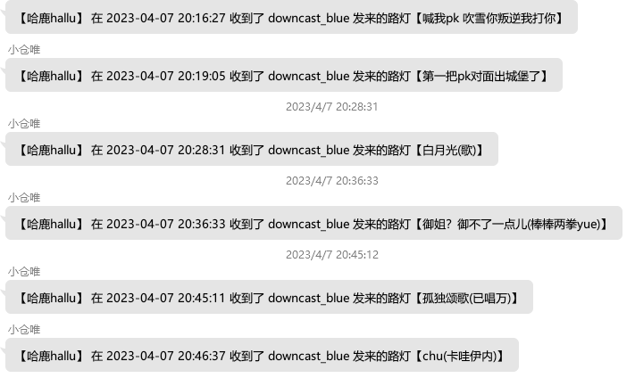

# nonebot_plugin_blive_danmaku
- 基于[nonebot2](https://v2.nonebot.dev/)开发的B站直播间弹幕监听Bot，参考了Haruka和blivechat的部分代码。  
- 起源于[哈鹿hallu](https://space.bilibili.com/3493118494116797)的一条动态，苦于做视频时没有人做路灯，翻录播的时候头都大了，说要花钱请个全职路灯，我寻思与其把钱送给别人，不如交给Bot去做路灯。

## 功能

- 用弹幕的形式记录直播高能点
- 弹幕指令为`#路灯`加上记录的内容
- 仅在开播时弹幕指令才会生效

## 安装
- 使用`nb-cli`安装插件  
```
nb plugin install nonebot_plugin_blive_danmaku
```

## 指令

|指令|说明|
|------|------|
|/添加订阅 UID|UID为B站用户的uid，不是直播间id，以下同理|
|/取消订阅 UID|删除订阅|
|/开启路灯 UID|开启直播间弹幕监听|
|/关闭路灯 UID|关闭直播间弹幕监听|
|/订阅列表|| 

## 效果预览 



## 更新日志  
- v0.1.2
    - fix局部变量无法正常更新的bug
- v0.1.0
    - 基于nonebot2，实现同步路灯弹幕到qq群  

## 感谢
- [HarukaBot](https://github.com/SK-415/HarukaBot)
- [blivechat](https://github.com/xfgryujk/blivechat)
- [nonebot2](https://v2.nonebot.dev/)

